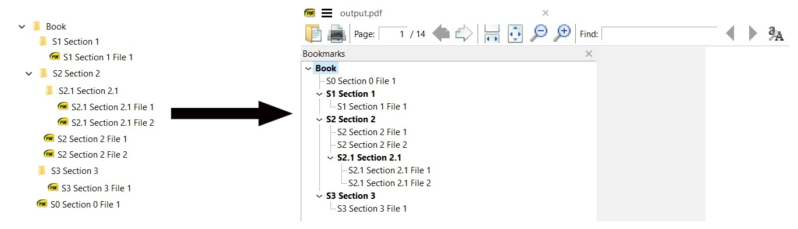

# Merge documents

This script takes as input a folder path and converts the underlying folder-pdffile structure to a single merged pdf document adding the folder and file names as bookmarks.

We can also provide a path to a pdf file to be added a bookmark to each page

## Example:

The folder-pdffile structure below

- Book
  - S1 Section 1
    - S1 Section 1 File 1
  - S2 Section 2
    - S2.1 Section 2.1
      - S2.1 Section 2.1 File 1
      - S2.1 Section 2.1 File 2
    - S2 Section 2 File 1
    - S2 Section 2 File 2
  - S3 Section 3
    - S3 Section 3 File 1
  - S0 Section 0 File 1

is converted to an identical bookmark structure on a single pdf file which is the result of merging the files

- S0 Section 0 File 1
- S1 Section 1 File 1
- S2 Section 2 File 1
- S2 Section 2 File 2
- S2.1 Section 2.1 File 1
- S2.1 Section 2.1 File 2
- S3 Section 3 File 1

with this order. (For each folder, recursively, files are considered first)



If a watermark file path is provided (single paged file), the watermark is added to every page.

The merged file is added at the input folder.

A `string_tree` method is implemented for the main class (`PdfMerger`), for testing purposes, which prints info about each node of the file structure above. A node corresponds to each line of the file structure.

## Usage

```
tests_folder = Path(__file__).resolve().parent.parent / 'tests'
init_path = tests_folder / 'Book'

    pdfm = PdfMerger(
        init_path=init_path,
        # Optional
        watermark_file_path=tests_folder / 'watermark.pdf',
    )

    pdfm.merge_files()
```

## Libraries

- PyPDF2 2.0.0
- tabulate
